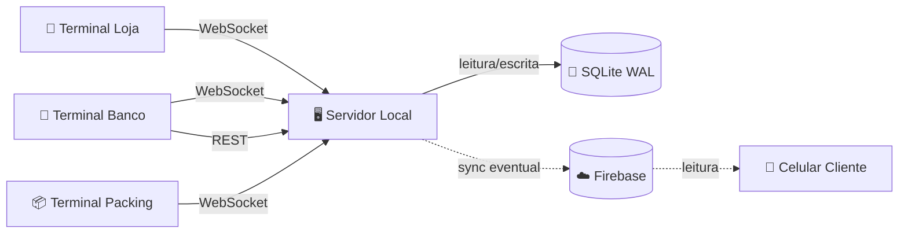

<p align="center">
  
</p>

<h1 align="center">Ouroboros</h1>

<p align="center">
  <em>A serpente que morde a própria cauda. O crédito nunca sai — apenas circula.</em>
</p>

<p align="center">
  
  
  
  
  
  
  
</p>

<p align="center">
  <a href="docs/architecture/overview.md">Arquitetura</a> •
  <a href="docs/api/reference.md">API Reference</a> •
  <a href="docs/guides/setup.md">Setup</a> •
  <a href="docs/guides/resilience.md">Resiliência</a>
</p>

---

## O que é

Sistema de **economia digital fechada** projetado para a **Feira da Troca na Etec Profª Terezinha Monteiro dos Santos** (Taquarituba/SP), adaptável para qualquer evento escolar com múltiplos pontos de venda.

Substitui moedas físicas (fichas, papelão) por uma camada digital que opera **100% offline** dentro da rede local — sem depender de internet, sem Firebase obrigatório, sem plano pago. Um notebook rodando o servidor + qualquer browser na mesma rede WiFi como terminal.

---

## Demo

### Servidor iniciando

```
┌──────────────────────────────────────────────────────┐
│                                                      │
│     ◆  OUROBOROS   Feira da Troca 2025               │
│                                                      │
├──────────────────────────────────────────────────────┤
│     Porta     8000                                   │
│     Banco     ./ouroboros.db                         │
│     Token     ••••                                   │
│     Limite    1000 comandas                          │
├──────────────────────────────────────────────────────┤
│     ↗  rede   http://192.168.1.10:8000               │
│                                                      │
└──────────────────────────────────────────────────────┘

12:00:00  PRONTO    servidor ouvindo em todas as interfaces
12:00:03  ADMIN ↑   admin  (1 ativa)
12:00:03  DB        conectado → ./ouroboros.db
12:00:05  LOJA ↑    store-1  XJ92KF  (1 ativa)
12:00:07  REST      POST /api/comanda 200  3ms
12:00:08  DÉBITO ✓  F001 (Alice)  -500 ETC  → 1500  [Cantina]
```

### Validação de produção (`smoke_test.js`)

```
$ node smoke_test.js

Ouroboros — Smoke Test / Validação de Produção
Server:  http://localhost:8000
Token:   (configurado)

── GET /  — Health check
  ✓  GET / → 200
  ✓  status = "online"

── GET /api/reports/economy_state
  ✓  sem token → 401
  ✓  token errado → 401
  ✓  com token válido → 200

── POST /api/stores  — criar loja
  ✓  sem token → 401
  ✓  sem nome → 400
  ✓  criar loja → 201
  ✓  token válido: 3LUJD7

── POST /api/distribution/:id/calculate
  ✓  calcular → 200
  ✓  1 caixa(s) criada(s)

... (80 verificações no total)

───────────────────────────────────────────
  PASSOU  80/80 verificações ✓
```

> Rode `node smoke_test.js` antes de qualquer feira para validar que todos os endpoints estão funcionando.

---

## Por que não cloud?

| Cenário | Cloud-first | Ouroboros |
|---|---|---|
| WiFi da escola cai | ❌ Sistema para | ✅ Continua normal |
| Rate limit Firebase | ❌ Bloqueado | ✅ Sem limite (local) |
| Latência de transação | ⚠️ 100–400ms | ✅ <10ms |
| Energia acaba | ❌ Perde estado | ✅ WAL mode preserva |
| Auditoria pós-evento | ⚠️ Depende do provedor | ✅ Event log imutável |
| Custo | 💸 Plano pago ou free-tier | ✅ Zero |

> Detalhes completos: [ADR-001: Local-First](docs/architecture/adr-001.md)

---

## Arquitetura



| Componente | Stack | Função |
|---|---|---|
| **Servidor** | Node.js + Express + SQLite **ou** Python + FastAPI + SQLite | Processa transações, WebSockets e dados analíticos |
| **Terminal Banco** | React + Vite | Dual Mode (Nova comanda / Crédito extra), gestão de lojas |
| **Terminal Loja** | React + Vite | Busca rápida por token de 6 chars, débito de carrinho |
| **Terminal Packing** | React + Vite | Gerenciamento de caixas de distribuição para voluntários |
| **Analytics (Telão)** | React + Recharts | KPIs e gráficos ao vivo via WebSocket |

### Decisões de projeto

| Decisão | Motivo | Documento |
|---|---|---|
| Local-first | Internet é opcional, não infraestrutura | [ADR-001](docs/architecture/adr-001.md) |
| SQLite | Zero config, WAL, backup = copiar arquivo | [ADR-002](docs/architecture/adr-002.md) |
| Event sourcing | Auditoria completa, saldo derivado, imutável | [ADR-003](docs/architecture/adr-003.md) |

---

## Quick Start

### 1. Backend

Escolha a opção que preferir — ambas expõem **exatamente a mesma API REST e WebSocket** e usam o mesmo banco SQLite.

#### Opção A — Node.js (`backend-node/`)

Requer **Node.js v22+**. Usa `node:sqlite` embutido — sem compilação nativa, sem quebrar em atualizações do Node.

```bash
cd backend-node
npm install
cp .env.example .env    # configure o ADMIN_TOKEN
npm start               # banco é criado automaticamente na primeira execução
```

#### Opção B — Python / FastAPI (`backend-python/`)

```bash
cd backend-python
python -m venv .venv

# Windows
.venv\Scripts\activate
# Linux/Mac
source .venv/bin/activate

pip install -r requirements.txt
cp .env.example .env    # configure o ADMIN_TOKEN
uvicorn app.main:app --host 0.0.0.0 --port 8000 --reload
```

### 2. Frontend

```bash
cd frontend
npm install
npm run dev
```

### 3. Acesse e Teste

Abra `http://localhost:5173`:

1. Selecione **Banco** → insira o `ADMIN_TOKEN` do `.env`
2. Crie lojas em **Gerenciar Lojas** → anote o token gerado (ex: `XJ92KF`)
3. Abra aba anônima → **Loja** → login com o token da loja
4. Analytics público: `http://localhost:5173/analytics` (ideal para projetor)

---

## API

### REST (header `token` para autenticação)

| Método | Rota | Auth | Descrição |
|---|---|---|---|
| `GET` | `/api/reports/economy_state` | Admin | Visão macro: emitido, circulante, contagens |
| `GET` | `/api/reports/analytics` | Pública | KPIs, top lojas, transações por minuto |
| `GET` | `/api/comanda/:code` | Admin | Busca comanda + saldo pelo código |
| `GET` | `/api/stores` | Admin | Lista lojas |
| `POST` | `/api/stores` | Admin | Cria loja (token de 6 chars gerado automaticamente) |
| `PUT` | `/api/stores/:id` | Admin | Renomeia loja |
| `POST` | `/api/stores/:id/revoke_token` | Admin | Regera token (desconecta terminais ativos) |
| `GET` | `/api/categories` | Pública | Lista categorias e preços |
| `POST` | `/api/categories` | Admin | Cria categoria |
| `GET` | `/api/distribution` | Admin | Lista rodadas de distribuição |
| `POST` | `/api/distribution` | Admin | Cria rodada de distribuição |
| `GET` | `/api/distribution/suggest` | Admin | Sugere número de caixas |
| `GET` | `/api/distribution/:id` | Admin | Detalhe da rodada com caixas e itens |
| `POST` | `/api/distribution/:id/calculate` | Admin | Calcula e persiste a distribuição de caixas |
| `PUT` | `/api/distribution/:id/activate` | Admin | Ativa rodada (arquiva a anterior) |
| `DELETE` | `/api/distribution/:id` | Admin | Exclui rodada (bloqueia se caixas em andamento) |
| `GET` | `/api/packing/active` | Admin | Distribuição ativa com status das caixas |
| `POST` | `/api/packing/boxes/:id/claim` | Admin | Voluntário assume uma caixa |
| `POST` | `/api/packing/boxes/:id/complete` | Admin | Conclui montagem da caixa |
| `POST` | `/api/packing/boxes/:id/cancel` | Admin | Libera caixa de volta para fila |

### WebSocket

| Endpoint | Direção | Mensagens |
|---|---|---|
| `ws/admin?token=` | Cliente → Servidor | `create_comanda`, `add_credit`, `register_category` |
| `ws/admin?token=` | Servidor → Cliente | `comanda_created`, `credit_confirmed`, `update_next_code`, `admin_balance_updated`, `category_updated` |
| `ws/store?token=` | Cliente → Servidor | `debit_request`, `balance_query` |
| `ws/store?token=` | Servidor → Cliente | `debit_confirmed`, `debit_rejected`, `balance_response`, `balance_updated` |
| `ws/packing?token=` | Servidor → Cliente | `box_claimed`, `box_completed`, `box_released`, `distribution_status_changed`, `distribution_recalculated` |

> Referência completa: [`docs/api/reference.md`](docs/api/reference.md)

---

## Estrutura do projeto

```
feira-da-troca/
├── backend-node/                   # Backend principal (Node.js + Express)
│   ├── src/
│   │   ├── api/
│   │   │   ├── rest.js             # 20 rotas REST
│   │   │   ├── wsAdmin.js          # WebSocket do Banco (criar comandas, crédito)
│   │   │   ├── wsStore.js          # WebSocket da Loja (débito, consulta)
│   │   │   ├── wsPacking.js        # WebSocket de Packing (broadcasts de caixas)
│   │   │   └── wsRegistry.js       # Singleton global de conexões WS
│   │   ├── services/
│   │   │   ├── comandaService.js
│   │   │   ├── storeService.js
│   │   │   ├── transactionService.js
│   │   │   ├── productService.js
│   │   │   ├── boxService.js
│   │   │   └── distributionService.js
│   │   ├── database.js             # node:sqlite (built-in, sem compilação nativa)
│   │   ├── config.js
│   │   ├── models.js
│   │   └── app.js
│   ├── tests/                      # Testes com node:test
│   │   ├── rest.test.js
│   │   ├── services.test.js
│   │   ├── ws.test.js
│   │   └── concurrency.test.js
│   ├── smoke_test.js               # Validação de produção (80 verificações)
│   ├── stress_test.js
│   ├── package.json
│   └── .env.example
├── backend-python/                 # Backend alternativo (Python + FastAPI)
│   ├── app/
│   │   ├── api/
│   │   │   ├── rest.py
│   │   │   ├── ws_admin.py
│   │   │   ├── ws_store.py
│   │   │   └── ws_packing.py
│   │   ├── services/
│   │   ├── database.py
│   │   ├── models.py
│   │   └── main.py
│   ├── tests/
│   ├── requirements.txt
│   └── .env.example
├── frontend/
│   └── src/
│       ├── pages/
│       │   ├── Login.jsx
│       │   ├── admin/Dashboard.jsx
│       │   ├── admin/Analytics.jsx
│       │   └── store/Terminal.jsx
│       ├── hooks/
│       │   ├── useAdminWebSocket.js
│       │   └── useStoreWebSocket.js
│       └── App.jsx
└── docs/                           # Documentação MkDocs
```

---

## Sobre o frontend

> **O frontend incluído é uma interface de demonstração funcional.**
>
> Implementa todos os fluxos do sistema (emissão de comandas, crédito, débito por token, gestão de lojas, packing e analytics ao vivo) com foco em **funcionalidade, não em design final**.
>
> A interface pode ser **livremente redesenhada, customizada ou substituída** — o backend (API REST + WebSocket) é a camada estável e documentada.

---

## Deploy para evento

```
Notebook do organizador (servidor)
├── IP estático: 192.168.1.10
├── Node.js:  cd backend-node && npm start        (porta 8000)
│       ou
├── Python:   uvicorn app.main:app --host 0.0.0.0  (porta 8000)
└── Frontend: cd frontend && npm run build
              → servido estático pelo próprio backend (FRONTEND_DIST=./public)

Terminais (qualquer browser na rede WiFi)
├── Banco:    http://192.168.1.10:8000 → login com ADMIN_TOKEN
└── Lojas:    http://192.168.1.10:8000 → login com token da loja (ex: XJ92KF)
```

**Checklist pré-evento:**
- [ ] Node.js v22+ instalado no notebook servidor
- [ ] `.env` configurado com `ADMIN_TOKEN` forte
- [ ] `node smoke_test.js` passando 80/80 ✓
- [ ] Lojas criadas e tokens distribuídos
- [ ] IP anotado e comunicado aos lojistas
- [ ] Backup do `ouroboros.db` a cada 30 min

> Plano completo de falhas: [`docs/guides/resilience.md`](docs/guides/resilience.md)

---

## Desenvolvido com IA

Este projeto foi desenvolvido com assistência de **GitHub Copilot** (modo agente) e **Claude Code** seguindo uma metodologia de **spec-driven development**: decisões arquiteturais tomadas por mim, especificadas com precisão, e executadas pelos agentes. O ganho de produtividade não foi "escrever código mais rápido" — foi elevar o gargalo de implementação para design.

> Detalhes completos: [`docs/guides/ai-development.md`](docs/guides/ai-development.md)

---

## Licença

MIT

---

<p align="center">
  Desenvolvido para a <strong>Etec Profª Terezinha Monteiro dos Santos</strong> — Taquarituba/SP
  <br>
  <sub>por <a href="https://github.com/fiorionrails">Caio Fiori Martins</a></sub>
</p>
