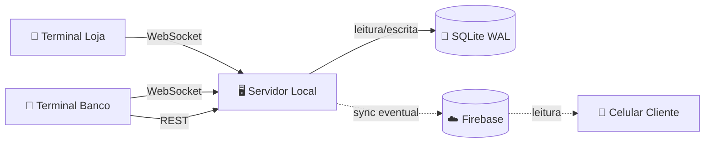

<p align="center">
  
</p>

<h1 align="center">Ouroboros</h1>

<p align="center">
  <em>A serpente que morde a própria cauda. O crédito nunca sai — apenas circula.</em>
</p>

<p align="center">
  
  
  
  
  
</p>

<p align="center">
  <a href="docs/architecture/overview.md">Arquitetura</a> •
  <a href="docs/api/reference.md">API Reference</a> •
  <a href="docs/guides/setup.md">Setup</a> •
  <a href="docs/guides/resilience.md">Resiliência</a>
</p>

---

## O que é

Sistema de **economia digital fechada** projetado para a **Feira da Troca na Etec Profª Terezinha Monteiro dos Santos** (Taquarituba/SP), adaptável para qualquer evento escolar com múltiplos pontos de venda.

Substitui moedas físicas (fichas, papelão) por uma camada digital que opera **100% offline** dentro da rede local — sem depender de internet, sem Firebase obrigatório, sem plano pago. Um notebook rodando o servidor + qualquer browser na mesma rede WiFi como terminal.

### Números reais (edição 2025)

| Métrica | Valor |
|---|---|
| Produtos cadastrados | ~6.200 |
| Comandas emitidas | 257 |
| Transações processadas | 2.320 |
| Pico de carga | ~450 tx em 30 min |
| Downtime por falha | 0 |

---

## Demo

<!-- GIF 1: Fluxo do Banco criando comanda -->
<p align="center">
  
  <br>
  <em>Banco Central — Emissão de comanda com carrinho de avaliação</em>
</p>

<!-- GIF 2: Fluxo da Loja debitando -->
<p align="center">
  
  <br>
  <em>Terminal da Loja — Busca de comanda, carrinho e débito em tempo real</em>
</p>

<!-- GIF 3: Gestão de Lojas -->
<p align="center">
  
  <br>
  <em>Admin — Criação de lojas e gerenciamento de tokens</em>
</p>

---

## Por que não cloud?

| Cenário | Cloud-first | Ouroboros |
|---|---|---|
| WiFi da escola cai | ❌ Sistema para | ✅ Continua normal |
| Rate limit Firebase | ❌ Bloqueado | ✅ Sem limite (local) |
| Latência de transação | ⚠️ 100–400ms | ✅ <10ms |
| Energia acaba | ❌ Perde estado | ✅ WAL mode preserva |
| Auditoria pós-evento | ⚠️ Depende do provedor | ✅ Event log imutável |
| Custo | 💸 Plano pago ou free-tier | ✅ Zero |

> Detalhes completos: [ADR-001: Local-First](docs/architecture/adr-001.md)

---

## Arquitetura



| Componente | Stack | Função |
|---|---|---|
| **Servidor** | FastAPI + Uvicorn + SQLite | Processa transações, event store, broadcast |
| **Terminal Banco** | React + Vite | Emissão de comandas, carrinho, gestão de lojas |
| **Terminal Loja** | React + Vite | Busca comanda, carrinho de venda, débito |
| **Firebase** | Firestore (opcional) | Espelho para consulta do cliente no celular |

### Decisões de projeto

| Decisão | Motivo | Documento |
|---|---|---|
| Local-first | Internet é opcional, não infraestrutura | [ADR-001](docs/architecture/adr-001.md) |
| SQLite | Zero config, WAL, backup = copiar arquivo | [ADR-002](docs/architecture/adr-002.md) |
| Event sourcing | Auditoria completa, saldo derivado, imutável | [ADR-003](docs/architecture/adr-003.md) |

---

## Quick Start

### 1. Backend

```bash
cd backend
python -m venv .venv

# Windows
.venv\Scripts\activate
# Linux/Mac
source .venv/bin/activate

pip install -r requirements.txt
cp .env.example .env          # configure o ADMIN_TOKEN
python manage.py              # cria o banco SQLite
uvicorn app.main:app --host 0.0.0.0 --port 8000 --reload
```

### 2. Frontend

```bash
cd frontend
npm install
npm run dev
```

### 3. Acesse

Abra `http://localhost:5173`:

1. Selecione **Banco** → insira o `ADMIN_TOKEN` do `.env`
2. Crie lojas pelo botão **Gerenciar Lojas** no header
3. Copie o token de uma loja
4. Abra outra aba → selecione **Loja** → cole o token

---

## Estrutura do projeto

```
feira-da-troca/
├── backend/
│   ├── app/
│   │   ├── api/
│   │   │   ├── rest.py           # Rotas REST (categorias, lojas, relatórios)
│   │   │   ├── ws_admin.py       # WebSocket do Banco (criar comandas)
│   │   │   └── ws_store.py       # WebSocket da Loja (débito, consulta)
│   │   ├── services/
│   │   │   ├── comanda_service.py
│   │   │   ├── store_service.py
│   │   │   ├── transaction_service.py
│   │   │   └── product_service.py
│   │   ├── config.py             # Pydantic settings (.env)
│   │   ├── database.py           # Conexão SQLite + PRAGMAs
│   │   ├── models.py             # Modelos Pydantic (Comanda, Event, Store, Category)
│   │   └── main.py               # FastAPI app + CORS + routers
│   ├── manage.py                 # Script de inicialização do banco
│   ├── requirements.txt
│   └── .env.example
├── frontend/
│   └── src/
│       ├── pages/
│       │   ├── Login.jsx         # Tela de autenticação
│       │   ├── admin/Dashboard.jsx  # Painel do Banco + modal de lojas
│       │   └── store/Terminal.jsx   # Terminal de vendas da Loja
│       ├── hooks/
│       │   ├── useAdminWebSocket.js
│       │   └── useStoreWebSocket.js
│       ├── App.jsx
│       └── index.css
├── docs/                         # Documentação MkDocs completa
└── mkdocs.yml
```

---

## API em 30 segundos

### REST (autenticação via header `token`)

| Método | Rota | Auth | Descrição |
|---|---|---|---|
| `GET` | `/api/reports/economy_state` | Admin | Visão macro da economia |
| `GET` | `/api/stores` | Admin | Lista lojas |
| `POST` | `/api/stores` | Admin | Cria loja (token gerado auto) |
| `PUT` | `/api/stores/{id}` | Admin | Renomeia loja |
| `POST` | `/api/stores/{id}/revoke_token` | Admin | Regera token (revoga anterior) |
| `GET` | `/api/categories` | Pública | Lista categorias e preços |
| `POST` | `/api/categories` | Admin | Cria categoria |

### WebSocket

| Endpoint | Fluxo | Mensagens |
|---|---|---|
| `ws/admin?token=` | Banco → Servidor | `create_comanda`, `register_category` |
| `ws/admin?token=` | Servidor → Banco | `comanda_created`, `update_next_code`, `admin_balance_updated` |
| `ws/store?token=` | Loja → Servidor | `debit_request`, `balance_query` |
| `ws/store?token=` | Servidor → Loja | `debit_confirmed`, `debit_rejected`, `balance_response`, `balance_updated` |

> Referência completa: [`docs/api/reference.md`](docs/api/reference.md)

---

## Sobre o frontend

> **O frontend incluído é uma interface de demonstração funcional.**
>
> Implementa todos os fluxos do sistema (login, carrinho de avaliação, emissão de comandas, consulta de saldo, débito, gestão de lojas) mas foi construído com foco em **funcionalidade, não em design final**.
>
> A interface pode ser **livremente redesenhada, customizada ou substituída** por qualquer tecnologia — o backend (API REST + WebSocket) é a camada estável e documentada.

---

## Deploy para evento

```
Notebook do organizador (servidor)
├── IP: 192.168.1.10
├── Backend: uvicorn --host 0.0.0.0 --port 8000
└── Frontend: npm run build → serve estático

Terminais (qualquer browser na rede WiFi)
├── Banco: http://192.168.1.10:5173 → login com ADMIN_TOKEN
└── Lojas: http://192.168.1.10:5173 → login com token da loja
```

**Checklist pré-evento:**
- [ ] Notebook com bateria + carregador
- [ ] `.env` configurado com `ADMIN_TOKEN` forte
- [ ] Banco inicializado (`python manage.py`)
- [ ] Lojas criadas e tokens distribuídos
- [ ] IP anotado e comunicado aos lojistas
- [ ] Backup do `ouroboros.db` a cada 30 min

> Plano completo de falhas: [`docs/guides/resilience.md`](docs/guides/resilience.md)

---

## Licença

MIT

---

<p align="center">
  Desenvolvido para a <strong>Etec Profª Terezinha Monteiro dos Santos</strong> — Taquarituba/SP
  <br>
  <sub>por <a href="https://github.com/fiorionrails">Caio Fiori Martins</a></sub>
</p>
