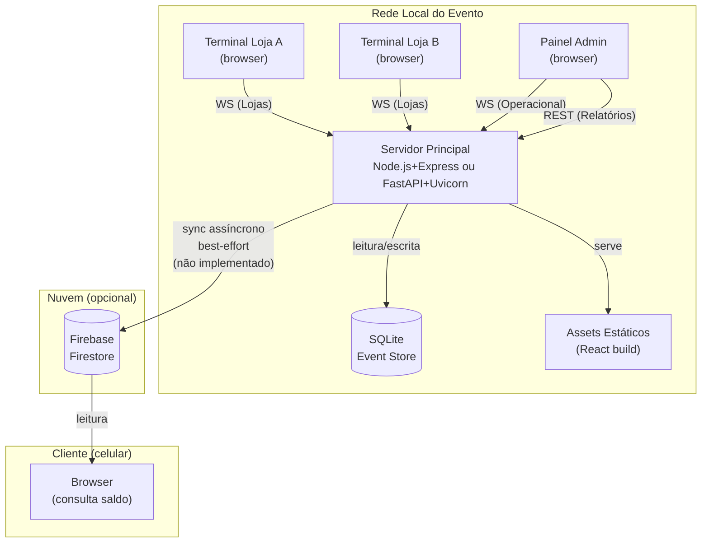

# Visão Geral da Arquitetura

Ouroboros opera dentro de um ambiente controlado: a rede local de um evento escolar. Esse contexto define tudo. Diferente de uma aplicação web convencional, não há usuários anônimos, não há escalabilidade horizontal necessária, e o maior risco não é carga — é **indisponibilidade de rede**.

A arquitetura reflete isso.

---

## Componentes

### Servidor Principal

O núcleo do sistema. Roda em qualquer máquina na rede local (um notebook comum é suficiente).

**Responsabilidades:**

- Processar e persistir todas as transações
- Manter o event store imutável (SQLite)
- Transmitir eventos em tempo real via WebSocket

**Stack:** Node.js + Express **ou** Python + FastAPI + Uvicorn, ambos com SQLite (WAL mode)

### Terminais de Loja

Qualquer dispositivo com browser conectado à rede local. Sem instalação.

**Responsabilidades:**

- Inserir o ID da comanda do cliente
- Enviar requisição de débito ao servidor
- Receber confirmação em tempo real
- Exibir histórico de transações da sessão

**Stack:** React + Vite (interface de demonstração — pode ser substituída)

### Interface de Administração e Operação (Admin & Banco)

Interface de gestão para organizadores e sub-administradores (operadores do Banco).

**Responsabilidades:**

- **Admin Principal:** Controle total, gestão de lojas (criar/revogar tokens), visão macro da economia.
- **Banco (Operador):** Cadastro de novos produtos/categorias, emissão de comandas com saldo inicial (carrinho de avaliação).
- Visualização do estado geral da economia.

!!! note "Sobre o frontend"
    O frontend React incluído é uma **interface de demonstração básica**. Implementa todos os fluxos (login, emissão de comandas, carrinho de vendas, débito, gestão de lojas) mas foi construído com foco em funcionalidade, não em design final. A interface pode ser livremente redesenhada, customizada ou substituída por qualquer tecnologia frontend — o backend (API REST + WebSocket) é a camada estável.

### Firebase Firestore (ideia não implementada)

!!! warning "Não implementado"
    A integração com Firebase descrita abaixo é uma **ideia futura**, não uma funcionalidade implementada. O campo `synced_to_firebase` existe no banco de dados como preparação, mas nenhum código de sync foi escrito. O sistema funciona 100% sem Firebase.

Espelho eventual dos eventos confirmados. Nunca é consultado pelo servidor principal durante operações críticas.

**Responsabilidades planejadas:**

- Receber eventos síncronizados do servidor (quando há internet)
- Servir consultas de saldo para o cliente final (celular)
- Não bloquear nunca — falha silenciosa, retry automático

---

## Diagrama de componentes



---
 
## Gestão de Produtos e Categorias

O Banco é responsável pela entrada de novos produtos no ecossistema da feira. A arquitetura de produtos segue uma estratégia de **Categorização Generalizada** por motivos de eficiência operacional (evitar o "trabalho braçal" de etiquetar milhares de itens individualmente):

- **Abstração de Itens:** Em vez de IDs únicos por objeto físico, o sistema trabalha com categorias (ex: CAMISETA, JAQUETA, BOLSA, BRINQUEDO).
- **Finalidade Organizacional:** A categorização serve para fins estatísticos e de auditoria, sem travar a venda em caso de erro humano (ex: vender uma Jaqueta como Camiseta).
- **Controle de Estoque:** O sistema rastreia o volume total de entradas e saídas por categoria de forma cumulativa (incremento), permitindo comparar o que entrou no Banco vs o que circulou nas lojas.
- **Preços Fixos:** Cada categoria possui uma tabela de preços definida centralmente no Banco.
 
 ---

## Modelo de dados

O sistema opera com **oito entidades** (cinco core + três para distribuição/packing):

```
Comanda
  id: UUID (interno)
  code: string (ID curto: "F001" a "F999")
  holder_name: string
  created_at: timestamp

Event
  id: UUID
  type: ENUM (credit | debit)
  comanda_id: UUID → Comanda
  amount: integer (centavos fictícios)
  store_id: UUID → Store
  timestamp: timestamp
  synced_to_firebase: integer (reservado para uso futuro — não implementado)

Store
  id: UUID
  name: string
  theme: string
  terminal_token: string

Category (Tabela de Preços e Categorização)
  id: UUID
  name: string (ex: "Jaqueta")
  price: integer (centavos fictícios)
  total_entries: integer (contador acumulativo de entrada no banco)
  total_exits: integer (contador acumulativo de vendas confirmadas)

Balance (view derivada — nunca armazenada diretamente)
  comanda_id: UUID
  balance: SUM(credits) - SUM(debits)

Distribution (rodada de distribuição de caixas)
  id: UUID
  name: string
  num_boxes: integer
  status: ENUM (planning | active | complete)
  needs_recalc: boolean
  created_at: timestamp
  completed_at: timestamp

Box (caixa física de produtos)
  id: UUID
  distribution_id: UUID → Distribution
  box_number: integer
  assigned_store_id: UUID → Store
  responsible_name: string (voluntário responsável)
  status: ENUM (pending | in_progress | done)
  claimed_at: timestamp
  completed_at: timestamp

BoxItem (itens planejados para uma caixa)
  id: UUID
  box_id: UUID → Box
  category_id: UUID → Category
  target_quantity: integer
```

!!! info "Por que saldo é uma view?"
    O saldo nunca é um campo armazenado. Ele é sempre computado ao agregar o event store.
    Isso garante que **não existe estado inconsistente**: se o event log está correto, o saldo está correto.
    Ver [ADR-003](adr-003.md) para a justificativa completa.

---

## Fluxo de uma transação (visão geral)

1. Cliente informa o número/ID da comanda no terminal da loja
2. Operador digita o ID e envia `debit_request` via WebSocket
3. Servidor valida saldo disponível consultando o event store
4. Se válido: persiste o evento no SQLite, retorna `debit_confirmed`
5. Todos os outros terminais conectados recebem broadcast do evento

**Tempo de resposta esperado:** < 50ms na rede local (SQLite + loopback)

---

## Decisões de design

As principais escolhas arquiteturais estão documentadas como ADRs (Architecture Decision Records). O projeto foca em suportar o fluxo de usuários (Lojas, Clientes) e os níveis de permissão administrativa (Admin e Banco/Sub-admin).

| Decisão | Documento |
|---|---|
| Por que a operação principal é local, não cloud | [ADR-001: Local-First](adr-001.md) |
| Por que SQLite em vez de PostgreSQL ou outro banco | [ADR-002: SQLite](adr-002.md) |
| Por que Event Sourcing em vez de CRUD convencional | [ADR-003: Event Sourcing](adr-003.md) |
