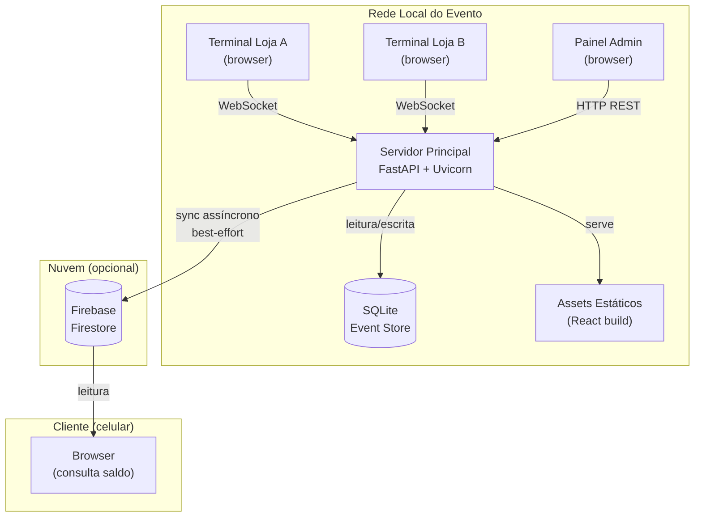

# Visão Geral da Arquitetura

Ouroboros opera dentro de um ambiente controlado: a rede local de um evento escolar. Esse contexto define tudo. Diferente de uma aplicação web convencional, não há usuários anônimos, não há escalabilidade horizontal necessária, e o maior risco não é carga — é **indisponibilidade de rede**.

A arquitetura reflete isso.

### Histórico e Dimensionamento (Base 2025)

Os dados da edição de 2025 da Feira da Troca confirmam que a carga é perfeitamente suportável por uma única instância local:

- **Volume Total:** ~6.200 produtos cadastrados.
- **Participantes Ativos:** 257 comandas (cartões) entregues.
- **Transações:** 2.320 produtos trocados ao longo do evento.
- **Pico de Carga:** ~450 transações em 30 minutos (menos de 1 transação a cada 4 segundos no pico).

Com esses números, qualquer notebook moderno processando SQLite consegue manter latências abaixo de 10ms sem esforço, tornando qualquer **complexidade de nuvem ou escalabilidade horizontal desnecessária e contraproducente**.

---

## Componentes

### Servidor Principal

O núcleo do sistema. Roda em qualquer máquina na rede local (um notebook comum é suficiente).

**Responsabilidades:**

- Processar e persistir todas as transações
- Manter o event store imutável (SQLite)
- Transmitir eventos em tempo real via WebSocket
- Sincronizar eventos confirmados pro Firebase de forma assíncrona

**Stack:** FastAPI (Python) + SQLite + Uvicorn

### Terminais de Loja

Qualquer dispositivo com browser conectado à rede local. Sem instalação.

**Responsabilidades:**

- Inserir o ID da comanda do cliente
- Enviar requisição de débito ao servidor
- Receber confirmação em tempo real
- Exibir histórico de transações da sessão

**Stack:** React + Vite (servido pelo próprio servidor)

### Painel Administrativo

Interface exclusiva do organizador do evento.

**Responsabilidades:**

- Criar e emitir comandas (IDs numéricos ou alfanuméricos)
- Definir o saldo inicial de cada participante
- Visualizar o estado geral da economia
- Exportar log de transações

### Firebase Firestore (camada de leitura)

Espelho eventual dos eventos confirmados. Nunca é consultado pelo servidor principal durante operações críticas.

**Responsabilidades:**

- Receber eventos síncronizados do servidor (quando há internet)
- Servir consultas de saldo para o cliente final (celular)
- Não bloquear nunca — falha silenciosa, retry automático

---

## Diagrama de componentes



---

## Modelo de dados

O sistema opera com **quatro entidades centrais**:

```
Comanda
  id: UUID (interno)
  code: string (ID curto para digitação)
  holder_name: string
  created_at: timestamp

Event
  id: UUID
  type: ENUM (credit | debit)
  comanda_id: UUID → Comanda
  amount: integer (centavos fictícios)
  store_id: UUID → Store
  timestamp: timestamp
  synced_to_firebase: boolean

Store
  id: UUID
  name: string
  theme: string
  terminal_token: string

Balance (view derivada — nunca armazenada diretamente)
  comanda_id: UUID
  balance: SUM(credits) - SUM(debits)
```

!!! info "Por que saldo é uma view?"
    O saldo nunca é um campo armazenado. Ele é sempre computado ao agregar o event store.
    Isso garante que **não existe estado inconsistente**: se o event log está correto, o saldo está correto.
    Ver [ADR-003](adr-003.md) para a justificativa completa.

---

## Fluxo de uma transação (visão geral)

1. Cliente informa o número/ID da comanda no terminal da loja
2. Operador digita o ID e envia `debit_request` via WebSocket
3. Servidor valida saldo disponível consultando o event store
4. Se válido: persiste o evento no SQLite, retorna `debit_confirmed`
5. Todos os outros terminais conectados recebem broadcast do evento
6. Worker assíncrono enfileira o evento para sync com Firebase

**Tempo de resposta esperado:** < 50ms na rede local (SQLite + loopback)

---

## Decisões de design

As principais escolhas arquiteturais estão documentadas como ADRs (Architecture Decision Records):

| Decisão | Documento |
|---|---|
| Por que a operação principal é local, não cloud | [ADR-001: Local-First](adr-001.md) |
| Por que SQLite em vez de PostgreSQL ou outro banco | [ADR-002: SQLite](adr-002.md) |
| Por que Event Sourcing em vez de CRUD convencional | [ADR-003: Event Sourcing](adr-003.md) |
