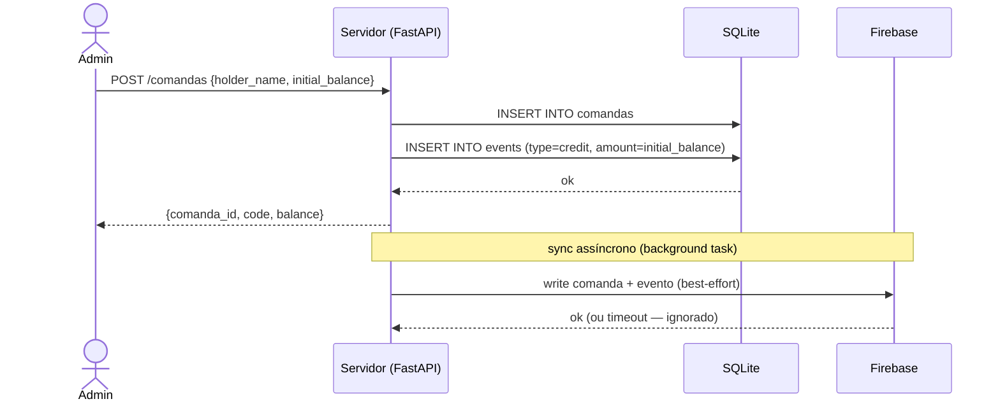
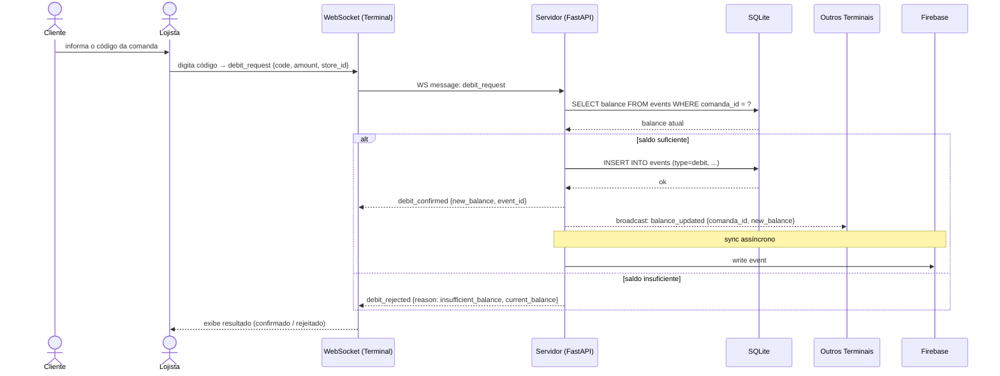
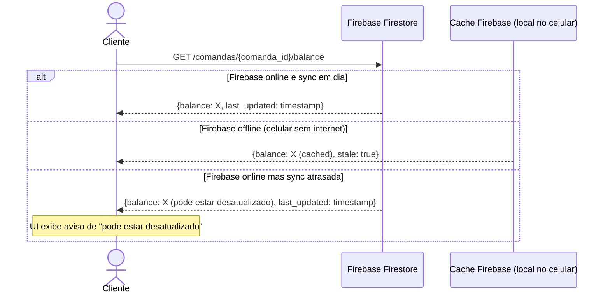
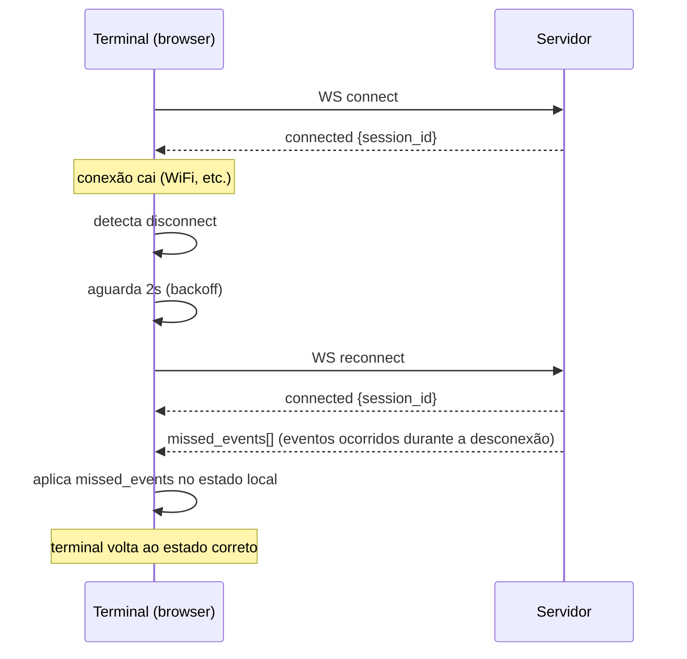
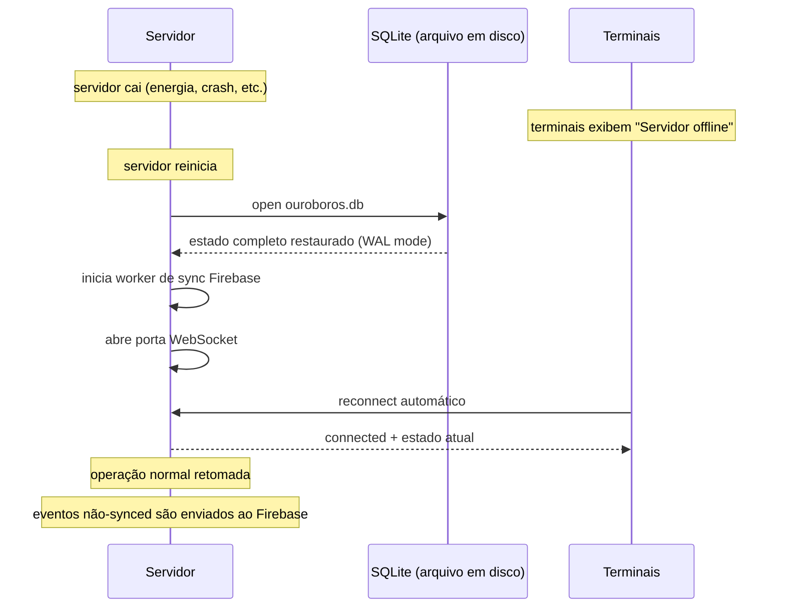

# Diagramas de Sequência

Todos os fluxos principais do sistema documentados com diagramas de sequência. Esses diagramas descrevem a ordem exata das operações e quem é responsável por cada passo.

---

## 1. Criação de comanda

O administrador emite uma comanda para um participante com saldo inicial.

**Pontos de atenção:**

- O código da comanda (`code`) é gerado no servidor e é curto o suficiente para digitação manual
- A resposta ao admin não espera o Firebase — a sync é fire-and-forget
- Se o Firebase estiver offline, a comanda ainda é criada normalmente

---

## 2. Débito em loja (fluxo principal)

Um participante compra algo numa loja. É o fluxo mais crítico do sistema.

**Pontos de atenção:**

- A validação de saldo e a inserção do evento acontecem dentro de uma transação SQLite — são atômicas
- O broadcast para outros terminais permite que o painel admin veja movimentações em tempo real
- O Firebase só recebe o evento após confirmação local — nunca antes

---

## 3. Consulta de saldo pelo cliente

O participante quer saber quanto tem no celular, sem interagir com nenhuma loja.

**Pontos de atenção:**

- O cliente **nunca** consulta o servidor principal — esse canal é reservado para operações de loja
- O saldo no Firebase pode estar levemente desatualizado — isso é esperado e documentado (eventual consistency)
- A UI deve sempre exibir o `last_updated` para o cliente ter contexto da atualização

---

## 4. Reconexão de terminal após queda

Um terminal de loja perde a conexão WebSocket (WiFi momentâneo, por exemplo) e reconecta.

**Pontos de atenção:**

- O frontend implementa reconnect automático com exponential backoff
- O servidor guarda os últimos N eventos da sessão para enviar no reconnect
- Nenhuma transação é perdida — o event store é a fonte da verdade

---

## 5. Recuperação após queda do servidor

O notebook do servidor é desligado (ou cai). O evento é reiniciado após o servidor voltar.

**Pontos de atenção:**

- O SQLite com WAL mode garante que nenhum evento confirmado é perdido
- O worker de sync ao reiniciar identifica eventos com `synced = 0` e os envia
- O downtime é o tempo de restart do servidor (tipicamente < 10 segundos)
