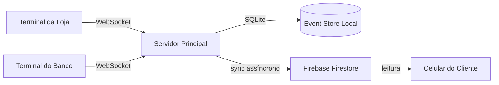

# Ouroboros

> *A serpente que morde a própria cauda. Um sistema onde o crédito nunca sai — apenas circula.*

---

Ouroboros é um sistema de **economia digital fechada** projetado especialmente para a **Feira da Troca na Etec Profª Terezinha Monteiro dos Santos** em Taquarituba, mas adaptável para outros eventos escolares com múltiplos pontos de venda. Substitui moedas físicas (papelão, fichas) por uma camada digital resiliente, operando **100% offline** dentro da rede local do evento e sincronizando de forma eventual com a nuvem quando há conexão disponível.

O projeto foi concebido para resolver um problema real do evento na Etec de Taquarituba: feiras com economia própria sofrem com o caos de moedas físicas, filas, erros de troco e impossibilidade de auditoria. A solução óbvia — colocar tudo em nuvem — quebra no primeiro momento em que o WiFi falha ou o plano gratuito atinge seu limite de requisições.

**Ouroboros parte da premissa inversa: a rede local é o ambiente principal. A nuvem é o espelho.**

---

## Problema que resolve

| Cenário | Solução antiga (fichas físicas) | Solução cloud-first | Ouroboros |
|---|---|---|---|
| WiFi cai | ✅ Funciona | ❌ Sistema para | ✅ Funciona |
| Rate limit da API | ✅ N/A | ❌ Requisições bloqueadas | ✅ N/A (local) |
| Cliente quer ver saldo | ⚠️ Requer contagem manual | ✅ Funciona | ✅ (via Firebase, leitura) |
| Auditoria de transações | ❌ Zero | ⚠️ Depende do provedor | ✅ Event log imutável |
| Energia acaba | ✅ Funciona | ❌ Sistema para | ✅ Estado persistido no disco |

---

## Visão do sistema em 30 segundos

- **Servidor principal** roda na rede local do evento (um notebook é suficiente)
- **Terminais** (Lojas e Banco) são qualquer browser na mesma rede — tablet, celular, notebook
- **Banco (Admin)** é o perfil de usuário responsável pela gestão: cadastro de categorias/preços, emissão de comandas, gestão de lojas (criar/revogar tokens)
- **Loja** é o perfil de usuário que consulta comandas e debita ETECOINS via carrinho de vendas
- **Firebase** recebe eventos já confirmados, apenas para consulta do cliente
- **Nenhuma transação depende de internet**

> **Nota sobre o frontend:** O frontend React incluído é uma **interface de demonstração funcional**. Ele implementa todos os fluxos do sistema mas foi construído de forma básica — a interface pode ser livremente redesenhada, customizada ou substituída por qualquer outra tecnologia. O backend (API REST + WebSocket) é a camada estável e documentada do projeto.

---

## Princípios de design

**Local-first.** A operação crítica (debitar e creditar) nunca depende de conexão externa.

**Event sourcing.** Cada transação é um evento imutável. O saldo é sempre derivado do histórico — nunca armazenado diretamente. Isso torna impossível "sumir" crédito sem rastro.

**Eventual consistency.** Firebase recebe os eventos quando pode. Se não pode, recebe depois. O cliente pode ver um saldo levemente desatualizado no celular, mas o servidor local é sempre a fonte da verdade.

**Operação zero-config.** Um único comando sobe o servidor. Sem Docker obrigatório, sem banco de dados externo, sem variáveis de ambiente complexas para a operação básica.

---

## Navegação

- [Arquitetura do sistema](architecture/overview.md) — como as peças se conectam
- [Decisões de design (ADRs)](architecture/adr-001.md) — por que cada escolha foi feita
- [Diagramas de sequência](diagrams/sequence.md) — fluxos detalhados de cada operação
- [Referência da API](api/reference.md) — endpoints, schemas, exemplos
- [Setup local](guides/setup.md) — como rodar em 5 minutos
- [Plano de resiliência](guides/resilience.md) — o que acontece quando algo falha